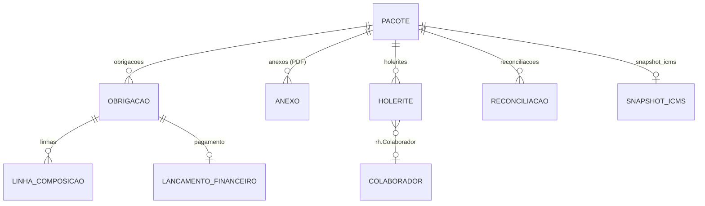

# Fiscal — Obrigações fiscais (pacote mensal)

> Submódulo do [Fiscal](fiscal.md). Centraliza as **guias e obrigações** do mês (DARF, FGTS,
> ISS, DIME/ICMS, DAS, holerites), com upload de PDFs, parsing automático, **reconciliação
> ERP × contabilidade** e baixa financeira.

**Portfólio (RFC):** Não — evolução ERP, fora do § 2.7.

## Objetivo

Receber o "pacote" mensal da contabilidade (PDFs), extrair os valores automaticamente,
conferir contra o que o ERP estima/possui e registrar pagamentos — por **competência**
(`AAAA-MM`) e por CNPJ da empresa.

## Status

| Camada | Status |
|--------|--------|
| Backend | **Implementado** — `models_obrigacoes.py` + `services/obrigacoes/` + API |
| Frontend | **Implementado** — lista/dashboard + página da competência |

**ID ERP:** `fiscal` · **Área:** Controle / Suprimentos

## Modelo de dados

`models_obrigacoes.py` (migração `0011_obrigacoes_fiscais`, depende de `rh.0001_initial`).



| Modelo | Papel / campos-chave |
|--------|----------------------|
| `PacoteObrigacaoFiscal` | Raiz: `public_id`, `cnpj`, `competencia` (único por CNPJ+competência), `recebido_em`, `pacote_completo` |
| `ObrigacaoFiscal` | Guia individual: `tipo`, `descricao`, `valor`, `valor_estimado`, `data_vencimento`, `data_pagamento`, `status`, `dados_extra`; FK opcional `documento_fiscal_emitido` (ISS ↔ NFS-e) |
| `LinhaComposicaoObrigacao` | Composição (ex.: DARF 1082/1099; DAS 1001–1012): `codigo`, `descricao`, `valor` |
| `AnexoObrigacaoFiscal` | PDF anexado: `tipo_arquivo`, `arquivo` (`fiscal/obrigacoes/{competencia}/{uuid}.pdf`), `parsed_data`, `parse_sucesso`, `parse_erros` |
| `SnapshotApuracaoIcms` | Resumo ICMS/DIME (OneToOne com pacote): débitos/créditos, saldo credor, imposto a recolher, valor contábil |
| `HoleriteCompetencia` | Holerite importado: `cpf`, `nome`, `tipo`, `proventos`, `desconto_inss`, `base_fgts`, `fgts_mes`; FK opcional `rh.Colaborador` |
| `ReconciliacaoFiscal` | Resultado ERP × contabilidade: `tipo`, `valor_interno`, `valor_contabilidade`, `diferenca`, `status` (único por pacote+tipo) |
| `LancamentoFinanceiroImposto` | Pagamento (OneToOne com obrigação): `valor`, `data`, `conta`, `centro_custo` |

**Choices** (`choices.py`): tipos de obrigação `DAS/INSS_DARF/FGTS/ISS/ICMS/OUTRO`;
status `PENDENTE/PAGO/VENCIDO/CANCELADO`; tipos de anexo `DARF/FGTS/ISS/DIME_ICMS/SIMPLES/HOLERITE/COMPROVANTE/OUTRO`;
tipos de reconciliação `DAS/DAS_INSS/INSS/FGTS/ISS/ICMS/PACOTE`; tipo de holerite `CLT/PRO_LABORE/OUTRO`.

## Services (`services/obrigacoes/`)

| Módulo | Função |
|--------|--------|
| `importar_pacote.py` | Cria/atualiza pacote, importa anexos, marca pago, exclui anexos; `TIPOS_ESPERADOS` define `pacote_completo` |
| `parse_pdf.py` | Dispatcher: extrai texto, detecta tipo, roteia ao parser; sinaliza PDF escaneado (sem texto) |
| `pdf_util.py` | Extração de texto (pypdf) + helpers BR (`parse_moeda_br`, `parse_data_br`, `parse_competencia…`, `detectar_tipo_anexo`) |
| `reconciliacao.py` | Roda as reconciliações do pacote; tolerâncias R$1 / 2%; status OK/ALERTA/ERRO |
| `dashboard.py` | `montar_dashboard_obrigacoes(cnpj)` — pendente, vencido, vence em 7 dias, alertas, 6 competências recentes |
| `das_simples.py` | Valor/composição do DAS a partir do PDF do Simples (códigos 1001–1012; INSS-DAS 1006) |
| `darf_inss.py` | Valor do DARF INSS (códigos 1082/1099/0561/1138), separado do DAS; limpa contaminação |
| `holerites_rh.py` | Casa holerites com `rh.Colaborador` (CPF, depois nome fuzzy); cria colaboradores faltantes |
| `contabilidade_manual.py` | Coluna "Contabilidade" manual quando o PDF não traz valor (PDF sempre prevalece) |
| `lancamento_financeiro.py` | `registrar_pagamento_obrigacao()` — cria `LancamentoFinanceiroImposto` |
| `parsers/` | Parsers por tipo: `darf.py`, `dime_icms.py`, `fgts.py`, `holerite.py`, `iss.py`, `simples.py` |

## Fluxo do usuário

1. **Criar pacote** da competência (`AAAA-MM`).
2. **Subir PDFs** (individual ou em lote) → parser detecta o tipo e extrai valores; alerta se a competência do PDF ≠ pacote.
3. **Obrigações** são criadas/atualizadas (`update_or_create` por pacote+tipo); ICMS grava `SnapshotApuracaoIcms`; ISS tenta vincular a NFS-e emitida; holerites são casados com o RH.
4. **Reconciliar**: reprocessa anexos e calcula as reconciliações (DAS, DAS-INSS, INSS, FGTS, ISS, ICMS) + resumo `PACOTE`. Valores manuais preenchem lacunas sem PDF.
5. **Baixa financeira**: marcar obrigação como paga cria o `LancamentoFinanceiroImposto`.

## API REST (`/api/v1/fiscal/obrigacoes/`)

CNPJ vem de `settings.FISCAL_EMPRESA_CNPJ` (não é entrada do request). Todas usam `HasEffectivePermission`.

| Método | URL | Permissão | Descrição |
|--------|-----|-----------|-----------|
| `GET` | `/dashboard/` | `fiscal.visualizar` | Totais, contagens, alertas, competências recentes |
| `GET` | `/pacotes/` · `/pacotes/{public_id}/` | `fiscal.visualizar` | Lista (anotada) / detalhe aninhado |
| `POST` | `/pacotes/criar/` | `fiscal.editar` | `{competencia, observacoes?}` |
| `POST` | `/pacotes/{public_id}/upload/` | `fiscal.editar` | `multipart`: `arquivo`, `tipo_forcado?` |
| `POST` | `/pacotes/{public_id}/upload-lote/` | `fiscal.editar` | `multipart`: `arquivos[]` |
| `POST` | `/pacotes/{public_id}/reconciliar/` | `fiscal.editar` | Recalcula reconciliações |
| `PATCH` | `/pacotes/{public_id}/reconciliacoes/{tipo}/contabilidade/` | `fiscal.editar` | Valor de contabilidade manual (`tipo` editável) |
| `GET`/`PATCH`/`POST` | `/itens/{public_id}/` | ver/editar | Detalhe; editar; `POST` marca pago (+ lançamento financeiro) |
| `DELETE` | `/anexos/{public_id}/` | `fiscal.editar` | Exclui anexo |
| `DELETE` | `/pacotes/{public_id}/anexos/` | `fiscal.editar` | Exclui todos os anexos |
| `PATCH` | `/holerites/{holerite_id}/` | `fiscal.editar` | Edita holerite / (des)vincula colaborador |
| `POST` | `/pacotes/{public_id}/holerites/conciliar-rh/` | `fiscal.editar` | Concilia holerites ↔ RH |
| `POST` | `/pacotes/{public_id}/holerites/criar-colaboradores/` | `fiscal.editar` | Cria colaboradores faltantes |

> Os endpoints de pacote/obrigação/anexo usam `public_id` (UUID); **holerite** usa o `id` inteiro.

## Integrações

- **RH** (`rh.Colaborador`): conciliação de holerites (CPF/nome) alimenta INSS/FGTS.
- **Fiscal emitidas** (`DocumentoFiscalEmitido`): ISS vincula-se à NFS-e emitida.
- **Simples Nacional** ([fiscal.md](fiscal.md#simples-nacional--projeção-de-das-estimativa)): DAS estimado × DAS do PDF; folha acumulada (Fator R).
- **Financeiro** (planejado): `LancamentoFinanceiroImposto` é o ponto de baixa.

## Frontend

- **Módulo:** `frontend/src/modules/fiscal`
- **Rotas** (ambas `fiscal.visualizar`): `/fiscal/obrigacoes` (`ObrigacoesFiscaisListPage`), `/fiscal/obrigacoes/:id` (`ObrigacoesFiscaisCompetenciaPage`, onde `:id` é o `public_id`).
- **Service:** `services/fiscalObrigacoesService.ts`; componentes `FiscalObrigacoesDashboardCard`, `ObrigacaoFiscalEditModal`, `ReconciliacaoContabilidadeEditModal`, `HoleriteRhEditModal`.

## Testes

```bash
cd backend
pytest apps/fiscal/tests/test_obrigacoes_api.py apps/fiscal/tests/test_obrigacoes_parsers.py \
       apps/fiscal/tests/test_reconciliacao_obrigacoes.py apps/fiscal/tests/test_das_simples.py \
       apps/fiscal/tests/test_darf_inss.py apps/fiscal/tests/test_holerites_rh.py \
       apps/fiscal/tests/test_contabilidade_manual.py -q
```

## A documentar

- [ ] Integração efetiva com o módulo Financeiro (contas a pagar)
- [ ] Regras completas de parsing por município (ISS) e por estado (DIME/ICMS)
