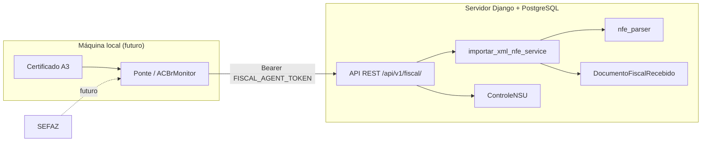
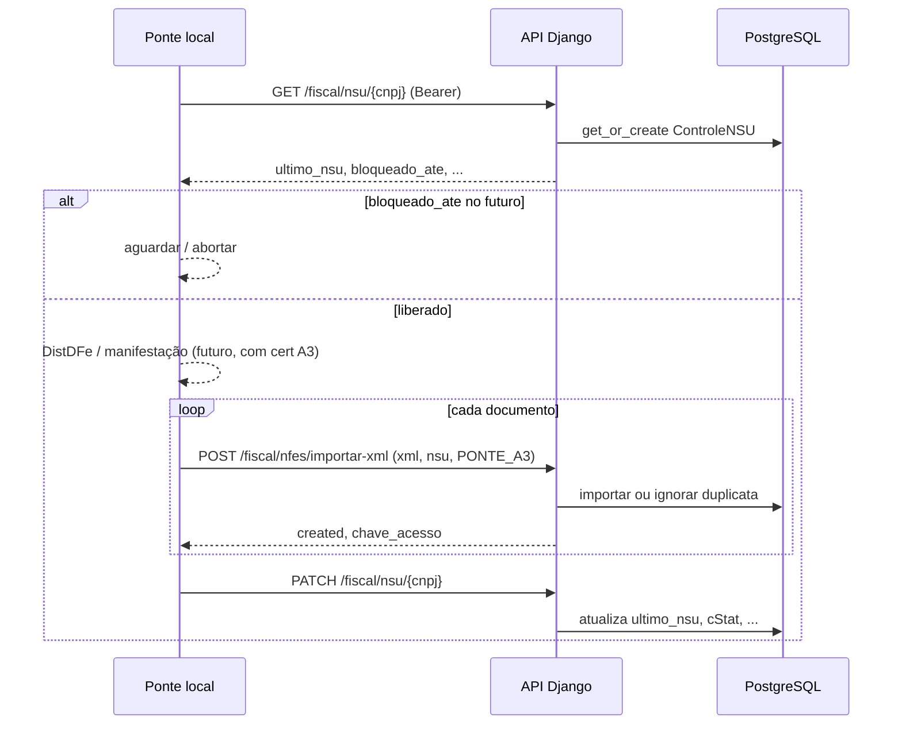

# Fiscal

## Objetivo

O módulo fiscal cobre duas frentes no servidor central (VPS / Django):

1. **Tributação por produto do catálogo** — `ItemFiscalProduto` (referência de ICMS/IPI/PIS/COFINS, alimentado pela importação NF-e do catálogo).
2. **NF-e recebidas contra o CNPJ da ZFW** — armazenamento do XML, itens da nota, controle de NSU, sincronização **SEFAZ nativa** (certificado A1 no servidor) e importação manual pelo portal.

A sincronização automática roda no **próprio servidor Django** via `python manage.py fiscal_sync_nsu` (sem ACBr, sem máquina local). O certificado A1 (`.pfx`) fica em volume/secrets no VPS.

## Arquitetura



| Responsabilidade | Servidor | Máquina local (futuro) |
|------------------|----------|-------------------------|
| Último NSU / maxNSU / cStat | Sim | Não |
| XML original e histórico | Sim | Não |
| Parser e itens da NF-e | Sim | Não |
| Anti-duplicidade (chave 44) | Sim | Não |
| Certificado físico A3 | Não | Sim |
| Consulta/assinatura SEFAZ | Não (fase futura no local) | Sim |

## Status

| Camada | Status |
|--------|--------|
| Backend — catálogo fiscal | **Parcial** — `ItemFiscalProduto` |
| Backend — NF-e recebidas | **Implementado (servidor)** — modelos, parser, importação, API, NSU |
| Backend — SEFAZ (A1 nativo) | **Implementado** — `apps/fiscal/services/sefaz/` + `fiscal_sync_nsu` |
| Backend — ponte A3 legada | **Opcional** — `tools/fiscal_ponte` (ACBr); substituída pelo sync nativo |
| Frontend — itens fiscais | **Parcial** — `src/modules/fiscal` |
| Frontend — NF-e recebidas | **Implementado** — `src/modules/fiscal` (lista, detalhe, importação manual, NSU leitura) |

**ID ERP:** `fiscal` · **Área:** Suprimentos

### Permissões

| Chave | Uso |
|-------|-----|
| `fiscal.visualizar` | Menu, rotas de leitura, listagens, detalhe, NSU (GET), relatórios |
| `fiscal.editar` | Importação manual, manifestação, sync SEFAZ pelo portal |

Perfis padrão: **Engenharia** e **Almoxarifado** recebem `fiscal.visualizar`; **Orçamentista** recebe visualizar + editar; **Colaborador (geral)** não recebe fiscal por padrão. Administradores têm todas as permissões.

O catálogo de produtos continua usando `material.visualizar_lista` / `material.editar_lista` (importação NF-e para cadastro de produtos).

#### Configurar acessos no portal

1. Acesse **Administração → Utilizadores** (`/administracao/utilizadores`) com conta administradora.
2. Ao criar ou editar um utilizador, marque na seção **Fiscal**:
   - **Ver módulo fiscal** (`fiscal.visualizar`) — menu Fiscal, listagens, relatórios, faturamento e projeção DAS.
   - **Editar módulo fiscal** (`fiscal.editar`) — importação de XMLs, manifestação e sincronização SEFAZ.
3. O tipo de utilizador pré-seleciona permissões padrão (Engenharia e Almoxarifado já recebem visualizar; Orçamentista recebe visualizar + editar).
4. O módulo **Fiscal** na central de módulos (`/`) só aparece para quem tem `fiscal.visualizar` (não basta permissão de catálogo).

Backend: chaves em `core/permissions.py` e `PermissaoUsuarioChoices`; API valida com `HasEffectivePermission` em cada view.

### Simples Nacional — projeção de DAS (estimativa)

| Recurso | Descrição |
|---------|-----------|
| Importação emitidas (lote) | `POST /api/v1/fiscal/nfes-emitidas/importar-lote/` — detecta NF-e/NFS-e, classifica CFOP |
| Classificação CFOP | Revenda (5102 etc.) → Anexo I; industrialização → II; serviços → Fator R (III/V) |
| Faturamento 12 meses | `GET /api/v1/fiscal/simples/faturamento/` — soma NF-es emitidas + ajustes manuais |
| Relatório faturamento | `GET /api/v1/fiscal/relatorios/faturamento/` — dashboard por mês, cliente, anexo e finalidade |
| Projeção DAS | `GET /api/v1/fiscal/simples/projecao-das/?competencia=AAAA-MM` |
| Perfil | `GET/PATCH /api/v1/fiscal/simples/perfil/` — folha e encargos para Fator R |

Parâmetros do relatório de faturamento: `data_inicio`, `data_fim`, `cliente` (nome ou CNPJ), `objetivo_saida`, `anexo_simples` (use `SERVICO` para notas sem anexo definido), `tipo_documento`, `top_clientes` (padrão 25), `incluir_documentos`, `limite_documentos`.

**Frontend:** `/fiscal/nfes-emitidas`, `/fiscal/nfes-emitidas/importar`, `/fiscal/relatorios/faturamento`, `/fiscal/simples/projecao-das`.

Requer `FISCAL_EMPRESA_CNPJ` no `.env` (CNPJ da ZFW). Resultado é **estimativa** — conferir com PGDAS-D.

## Backend

- **App:** `backend/apps/fiscal/`
- **Migração NF-e recebidas:** `0003_documentos_fiscais_recebidos`

### Modelos — catálogo (existente)

| Modelo | Uso |
|--------|-----|
| `ItemFiscalProduto` | FK `catalogo.Produto`; tributos de referência; criado na importação NF-e do [catálogo](catalogo.md) |

### Modelos — documentos recebidos (NF-e)

| Modelo | Campos principais |
|--------|-------------------|
| `ControleNSU` | `cnpj` (único), `ultimo_nsu`, `max_nsu`, `ultimo_cstat`, `ultimo_motivo`, `bloqueado_ate`, `ultima_consulta` |
| `DocumentoFiscalRecebido` | `chave_acesso` (44, única), emitente/destinatário, número/série, `xml_original`, `status_importacao`, `origem_importacao` |
| `ItemDocumentoFiscal` | FK documento; `numero_item`, produto, valores; `importado_para_produto` (futuro catálogo) |

**Choices**

- `status_importacao`: `RECEBIDA`, `PROCESSADA`, `ERRO`, `IGNORADA`
- `origem_importacao`: `MANUAL`, `PONTE_A3`, `API`, `OUTRO`

CNPJ e NSU são normalizados no `save()` (somente dígitos; NSU com 15 posições quando possível).

### Serviços

| Arquivo | Função |
|---------|--------|
| `services/nfe_parser.py` | `parse_nfe_xml(xml: str)` → dict; raiz `nfeProc` ou `NFe`; namespace Portal Fiscal |
| `services/importar_xml_nfe_service.py` | `importar_xml_nfe(...)` → `{created, documento, message}`; `transaction.atomic` |
| `services/__init__.py` | Funções do catálogo (`p_ipi_referencia_produto`, `criar_item_fiscal_importacao_nfe`, …) |

### Autenticação do agente (ponte A3)

Variável de ambiente:

```env
FISCAL_AGENT_TOKEN=<token_longo_gerado>
```

Header em todas as rotas do agente:

```http
Authorization: Bearer <FISCAL_AGENT_TOKEN>
```

Implementação: `apps/fiscal/authentication.py` (`FiscalAgentAuthentication`).

- Token ausente ou inválido → recusado (401/403).
- `FISCAL_AGENT_TOKEN` vazio no servidor → 403 nas rotas do agente.

Rotas de **listagem/detalhe** de NF-e usam **JWT** (usuário do portal), como o restante da API.

## API REST

Prefixo do projeto: **`/api/v1/fiscal/`** (registrado em `config/urls.py` → `apps.fiscal.api.urls`).

### NF-es recebidas (JWT)

| Método | URL | Descrição |
|--------|-----|-----------|
| `GET` | `/api/v1/fiscal/nfes/` | Lista paginada (sem `xml_original`) |
| `GET` | `/api/v1/fiscal/nfes/{id}/` | Detalhe com itens e `xml_original` |
| `POST` | `/api/v1/fiscal/nfes/importar-manual/` | Importação manual pelo portal (origem `MANUAL`) |

Permissão listagem/detalhe/NSU (GET): `fiscal.visualizar`. Importação manual: `fiscal.editar`.

**Filtros (query):** `chave_acesso`, `cnpj_emitente`, `cnpj_destinatario`, `numero`, `serie`, `status_importacao`, `origem_importacao`.

**Ordenação:** `-data_emissao`, `-criada_em`.

### Importar XML (agente Bearer)

| Método | URL |
|--------|-----|
| `POST` | `/api/v1/fiscal/nfes/importar-xml/` |

**Body (JSON):**

```json
{
  "xml": "<nfeProc>...</nfeProc>",
  "nsu": "000000000123456",
  "cnpj_destinatario": "00000000000000",
  "origem_importacao": "MANUAL"
}
```

| Campo | Obrigatório | Notas |
|-------|-------------|-------|
| `xml` | Sim | String completa da NF-e |
| `nsu` | Não | Normalizado para 15 dígitos |
| `cnpj_destinatario` | Não | 14 dígitos após limpeza; se omitido, usa o `dest` do XML |
| `origem_importacao` | Não | Default `MANUAL`; ponte deve usar `PONTE_A3` |

**Resposta — nova NF-e (201):**

```json
{
  "created": true,
  "message": "NF-e importada com sucesso.",
  "documento_id": 1,
  "chave_acesso": "3520..."
}
```

**Resposta — já cadastrada (200):**

```json
{
  "created": false,
  "message": "NF-e já cadastrada.",
  "documento_id": 1,
  "chave_acesso": "3520..."
}
```

**Erro de XML (400):** `{ "detail": "..." }` (mensagem do parser/serviço).

### Controle NSU

| Método | URL | Auth | Descrição |
|--------|-----|------|-----------|
| `GET` | `/api/v1/fiscal/nsu/{cnpj}/` | JWT ou agente | Retorna controle; cria com `ultimo_nsu=000000000000000` se não existir |
| `PATCH` | `/api/v1/fiscal/nsu/{cnpj}/` | Agente Bearer | Atualização parcial dos campos de sincronização |

### Manifestação do destinatário

| Método | URL | Auth | Descrição |
|--------|-----|------|-----------|
| `POST` | `/api/v1/fiscal/nfes/{id}/solicitar-manifestacao/` | JWT | Enfileira evento (portal); requer `fiscal.editar` |
| `GET` | `/api/v1/fiscal/nfes/manifestacoes-pendentes/` | Agente | Lista pendentes para a ponte A3 |
| `POST` | `/api/v1/fiscal/nfes/{id}/registrar-manifestacao/` | Agente | Registra sucesso/erro após `NFe.EnviarEvento` no ACBr |

**Body solicitar (portal):**

```json
{
  "tipo": "CONFIRMACAO",
  "justificativa": ""
}
```

Tipos: `CIENCIA` (210210), `CONFIRMACAO` (210200), `DESCONHECIMENTO` (210220), `NAO_REALIZADA` (210240, justificativa obrigatória ≥ 15 caracteres).

Status no documento: `NAO_SOLICITADA`, `PENDENTE`, `MANIFESTADA`, `ERRO`.

Filtro listagem: `manifestacao_status` (query).

A ponte processa pendentes no fim de cada `fiscal-ponte sync` ou via `fiscal-ponte manifestar-pendentes` (modo `stub` simula sucesso em homologação).

**PATCH — exemplo:**

```json
{
  "ultimo_nsu": "000000000123456",
  "max_nsu": "000000000123900",
  "ultimo_cstat": "137",
  "ultimo_motivo": "Nenhum documento localizado",
  "bloqueado_ate": "2026-06-04T15:00:00-03:00",
  "ultima_consulta": "2026-06-04T14:00:00-03:00"
}
```

### Itens fiscais do catálogo (JWT)

| Método | URL |
|--------|-----|
| `GET` | `/api/v1/fiscal/itens-fiscais/` |
| `GET` | `/api/v1/fiscal/config/` | `cnpj_empresa`, `agente_ponte_configurado` (portal) |

Permissão: `fiscal.visualizar`.

Variáveis servidor (`.env`):

```env
FISCAL_AGENT_TOKEN=...
FISCAL_EMPRESA_CNPJ=12345678000199
```

## Sincronização SEFAZ nativa (certificado A1)

Código: `backend/apps/fiscal/services/sefaz/`

| Componente | Função |
|------------|--------|
| `certificado.py` | Carrega `.pfx` (PKCS12) para mTLS e assinatura XML |
| `distribuicao_dfe.py` | `NFeDistribuicaoDFe` — DistDFe por `ultNSU` |
| `manifestacao.py` | Manifestação do destinatário (`NFeRecepcaoEvento4`) |
| `nsu_sync.py` | Orquestra DistDFe → `importar_xml_nfe` → manifestações pendentes |

### Variáveis (`.env` do servidor)

```env
FISCAL_EMPRESA_CNPJ=07284171000139
FISCAL_CERT_PATH=/opt/zfw/secrets/certificado-a1.pfx
FISCAL_CERT_PASSWORD=...
FISCAL_SEFAZ_UF=42
FISCAL_SEFAZ_AMBIENTE=1
FISCAL_SEFAZ_PROVIDER=native
FISCAL_SYNC_MAX_CICLOS=20
```

- `FISCAL_SEFAZ_AMBIENTE`: `1` produção, `2` homologação.
- `FISCAL_SEFAZ_PROVIDER=stub` — testes sem certificado (cStat 137).
- **Não** commitar o `.pfx` nem a senha.

### Portal (manual)

Botão **Buscar NF-es na SEFAZ** na home fiscal e em **Controle NSU** — chama `POST /api/v1/fiscal/nfes/sincronizar-sefaz/` (JWT, permissão `fiscal.editar`).

### Comando (opcional / agendamento futuro)

```bash
python manage.py fiscal_sync_nsu
python manage.py fiscal_sync_nsu --dry-run
python manage.py fiscal_sync_nsu --sem-manifestacao
```

### Agendamento (cron no VPS)

```cron
*/15 * * * * cd /opt/zfw/app/backend && /opt/zfw/venv/bin/python manage.py fiscal_sync_nsu >> /var/log/zfw/fiscal_sync.log 2>&1
```

No Docker, monte o certificado como volume read-only e passe as variáveis via `.env`.

### Origem de importação

NF-es obtidas pelo job usam `origem_importacao=SEFAZ_SYNC` (distinto de `PONTE_A3` legado e `MANUAL`).

---

## Ponte A3 local (`tools/fiscal_ponte`) — legado

Agente Python na máquina com certificado. Código: [tools/fiscal_ponte/README.md](../../tools/fiscal_ponte/README.md).

| Comando | Função |
|---------|--------|
| `fiscal-ponte ping-api` | Valida `FISCAL_AGENT_TOKEN` e GET NSU |
| `fiscal-ponte ping-acbr` | Testa TCP ACBrMonitor (`ACBr.Status`) |
| `fiscal-ponte sync` | Ciclo DistDFe → POST XML → PATCH NSU |

Provedores SEFAZ (`FISCAL_PONTE_SEFAZ_PROVIDER`): `stub`, `acbr` (ACBrMonitor TCP 3434), `folder` (XMLs de pasta).

## Contrato da ponte A3

### Princípios

1. A ponte **lê** o estado do NSU no servidor antes de consultar a SEFAZ.
2. A ponte **envia** XML bruto ao servidor; o servidor faz parse, validação e persistência.
3. A ponte **atualiza** o NSU no servidor após cada ciclo SEFAZ (sucesso, vazio, bloqueio, erro).
4. Nenhum XML definitivo, histórico ou item de produto fica armazenado na máquina local.

### Fluxo recomendado



### Operações obrigatórias da ponte

| # | Operação | Endpoint | Quando |
|---|----------|----------|--------|
| 1 | Obter estado NSU | `GET .../nsu/{cnpj}/` | Início de cada ciclo |
| 2 | Importar documento | `POST .../nfes/importar-xml/` | Para cada XML obtido na SEFAZ |
| 3 | Persistir estado NSU | `PATCH .../nsu/{cnpj}/` | Fim do ciclo (sucesso ou erro SEFAZ) |

### Payloads que a ponte envia

#### 1. Importação de documento

```http
POST /api/v1/fiscal/nfes/importar-xml/
Authorization: Bearer <FISCAL_AGENT_TOKEN>
Content-Type: application/json
```

```json
{
  "xml": "<conteúdo integral do nfeProc ou proc vinculado>",
  "nsu": "000000000000789",
  "origem_importacao": "PONTE_A3"
}
```

Regras:

- Enviar o XML **exatamente** como retornado (o servidor grava em `xml_original`).
- Repetir o POST com o mesmo XML é seguro: o servidor responde `created: false` pela chave de 44 dígitos.
- Não interpretar CFOP/NCM/produtos na ponte.

#### 2. Atualização do controle NSU

```http
PATCH /api/v1/fiscal/nsu/12345678000199/
Authorization: Bearer <FISCAL_AGENT_TOKEN>
Content-Type: application/json
```

Campos típicos após consulta DistDFe:

| Campo | Origem sugerida (SEFAZ) |
|-------|-------------------------|
| `ultimo_nsu` | Maior NSU processado com sucesso |
| `max_nsu` | `maxNSU` da última resposta |
| `ultimo_cstat` | `cStat` da última resposta |
| `ultimo_motivo` | `xMotivo` |
| `bloqueado_ate` | Quando `cStat` indicar consumo indevido (ex. 656) |
| `ultima_consulta` | Timestamp ISO 8601 do ciclo |

A ponte **não** deve manter cópia autoritativa desses valores; o PostgreSQL no servidor é a fonte da verdade.

### Respostas que a ponte deve tratar

| HTTP | Situação | Ação sugerida na ponte |
|------|----------|------------------------|
| 201 | NF-e nova | Log local opcional; seguir próximo documento |
| 200 | Duplicata | Ignorar; considerar NSU/documento já sincronizado |
| 400 | XML inválido | Log + não reenviar o mesmo XML sem correção |
| 401/403 | Token | Verificar `FISCAL_AGENT_TOKEN` e relógio; não gravar estado local |
| 5xx | Servidor | Retry com backoff; não avançar `ultimo_nsu` localmente |

### Configuração mínima da ponte (checklist)

- [ ] URL base da API: `https://api.zfw.com.br/api/v1/`
- [ ] `FISCAL_AGENT_TOKEN` em variável segura (não no repositório)
- [ ] CNPJ da ZFW (14 dígitos) para rotas `/nsu/{cnpj}/`
- [ ] Certificado A3 conectado na máquina local
- [ ] Serviço técnico (ex. ACBrMonitorPLUS) apenas para operações com certificado
- [ ] Sem PostgreSQL / sem fila de negócio local

### O que fica explicitamente fora da ponte

- Manifestação do destinatário via portal e ponte A3 (`solicitar-manifestacao`, `manifestar-pendentes`).
- Vínculo `ItemDocumentoFiscal` → `catalogo.Produto` (`importado_para_produto`).
- Regras de CFOP, estoque, compras ou orçamentos.

## Configuração (servidor)

```env
# .env do backend (Docker / VPS)
FISCAL_AGENT_TOKEN=<gerar_token_longo_aleatorio>
```

Gerar token (exemplo):

```bash
python -c "import secrets; print(secrets.token_urlsafe(48))"
```

## Admin Django

- `ControleNSU`, `DocumentoFiscalRecebido` (inline de itens somente leitura), `ItemFiscalProduto`

## Frontend

| Rota | Página | Permissão |
|------|--------|-----------|
| `/fiscal` | `FiscalHomePage` — busca de produtos e atalhos | `fiscal.visualizar` |
| `/fiscal/nfes` | `NfesRecebidasListPage` — lista filtrada | `fiscal.visualizar` |
| `/fiscal/nfes/:id` | `NfeRecebidaDetailPage` — itens + XML | `fiscal.visualizar` |
| `/fiscal/nfes/importar` | `NfeImportarManualPage` — POST `importar-manual` | `fiscal.editar` |
| `/fiscal/nsu` | `ControleNsuPage` — leitura NSU (JWT) | `fiscal.visualizar` |
| `/fiscal/itens-fiscais` | `ItensFiscaisListPage` | `fiscal.visualizar` |
| `/fiscal/relatorios/nfes` | `RelatorioNfesPage` — NF-es recebidas por período | `fiscal.visualizar` |
| `/fiscal/relatorios/faturamento` | `RelatorioFaturamentoPage` — dashboard por cliente | `fiscal.visualizar` |
| `/fiscal/nfes-emitidas` | `NfesEmitidasListPage` | `fiscal.visualizar` |
| `/fiscal/nfes-emitidas/importar` | `NfeEmitidaImportarPage` | `fiscal.editar` |
| `/fiscal/simples/projecao-das` | `ProjecaoDasSimplesPage` | `fiscal.visualizar` |

Serviços HTTP: `fiscalNfeService.ts`, `fiscalSimplesService.ts`. Importação de **produtos** continua em `/catalogo/produtos/importar-nfe`.

## Integrações

| Módulo | Relação |
|--------|---------|
| [Catálogo](catalogo.md) | Importação NF-e de **entrada** (fornecedor) → produtos + `ItemFiscalProduto` |
| [Orçamentos](orcamentos.md) | IPI % de referência via `p_ipi_referencia_produto` |
| [Integrações](integracoes.md) | Ponte A3 listada como integração externa futura |

## Testes

```bash
cd backend
pytest apps/fiscal/tests/ -q
```

Cobertura principal: parser (`nfeProc` / `NFe`), serviço de importação, API JWT + agente Bearer, NSU GET/PATCH.

## Roadmap (servidor)

- [x] Frontend: listagem/detalhe NF-e recebidas, importação manual, NSU (leitura)
- [x] Manifestação do destinatário
- [ ] Integração itens NF-e → catálogo (`importado_para_produto`)
- [ ] Consulta SEFAZ (somente se orquestrada no servidor com ponte retornando XML bruto)

## Roadmap (ponte local)

- [x] Cliente HTTP (GET/PATCH NSU, POST importar-xml)
- [x] Ciclo `sync` (orquestração no servidor como fonte de verdade do NSU)
- [x] Adaptador ACBrMonitor `NFe.DistribuicaoDFePorUltNSU`
- [x] Manifestação do destinatário na SEFAZ (portal + ponte)
- [x] Agendamento (tarefa Windows) e serviço NSSM — `scripts/fiscal-ponte-install-*.ps1`, [PRODUCAO.md](../../tools/fiscal_ponte/PRODUCAO.md)
- [x] Retry/backoff 5xx na API central
- [ ] Alertas operacionais (e-mail/Telegram) quando sync falhar
