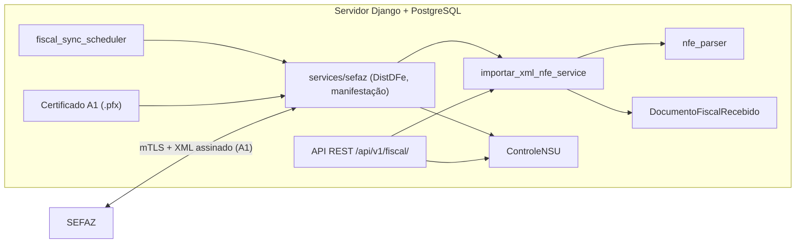

# Fiscal

## Objetivo

O módulo fiscal cobre, no servidor central (VPS / Django):

1. **Tributação por produto do catálogo** — `ItemFiscalProduto` (referência de ICMS/IPI/PIS/COFINS, alimentado pela importação NF-e do catálogo).
2. **NF-e recebidas contra o CNPJ da ZFW** — armazenamento do XML, itens da nota, controle de NSU, sincronização **SEFAZ nativa** (certificado A1 no servidor), consulta por chave e importação manual pelo portal.
3. **NF-e emitidas + Simples Nacional** — importação de emitidas, classificação CFOP, faturamento 12 meses e projeção de DAS.
4. **NFS-e recebidas (ADN)** — sincronização do Ambiente de Dados Nacional de NFS-e. Ver [fiscal-nfse-adn.md](fiscal-nfse-adn.md).
5. **Obrigações fiscais (pacote mensal)** — upload de guias/PDFs (DARF, FGTS, ISS, DIME/ICMS, DAS, holerites), parsing, reconciliação ERP × contabilidade e baixa financeira. Ver [fiscal-obrigacoes.md](fiscal-obrigacoes.md).

A sincronização com a SEFAZ é **100% nativa no servidor Django** (certificado A1 `.pfx` em volume/secrets no VPS, mTLS e assinatura XML diretamente no backend). O scheduler nativo `fiscal_sync_scheduler` (serviço `backend-scheduler`) executa a consulta DistDFe periodicamente — sem máquina local nem componentes externos.

## Arquitetura



| Responsabilidade | Servidor (A1 nativo) |
|------------------|----------------------|
| Último NSU / maxNSU / cStat | Sim |
| XML original e histórico | Sim |
| Parser e itens da NF-e | Sim |
| Anti-duplicidade (chave 44) | Sim |
| Certificado A1 (.pfx) | Sim |
| Consulta/assinatura SEFAZ | Sim |

## Status

| Camada | Status |
|--------|--------|
| Backend — catálogo fiscal | **Parcial** — `ItemFiscalProduto` |
| Backend — NF-e recebidas | **Implementado (servidor)** — modelos, parser, importação, API, NSU |
| Backend — SEFAZ (A1 nativo) | **Implementado** — `apps/fiscal/services/sefaz/` + `fiscal_sync_nsu` |
| Frontend — itens fiscais | **Parcial** — `src/modules/fiscal` |
| Frontend — NF-e recebidas | **Implementado** — `src/modules/fiscal` (lista, detalhe, importação manual, NSU leitura) |

**ID ERP:** `fiscal` · **Área:** Suprimentos

### Permissões

| Chave | Uso |
|-------|-----|
| `fiscal.visualizar` | Menu, rotas de leitura, listagens, detalhe, NSU (GET), relatórios |
| `fiscal.editar` | Importação manual, manifestação, sync SEFAZ pelo portal |

Perfis padrão: **Engenharia** e **Almoxarifado** recebem `fiscal.visualizar`; **Orçamentista** recebe visualizar + editar; **Colaborador (geral)** não recebe fiscal por padrão. Administradores têm todas as permissões.

O catálogo de produtos continua usando `material.visualizar_lista` / `material.editar_lista` (importação NF-e para cadastro de produtos).

#### Configurar acessos no portal

1. Acesse **Administração → Utilizadores** (`/administracao/utilizadores`) com conta administradora.
2. Ao criar ou editar um utilizador, marque na seção **Fiscal**:
   - **Ver módulo fiscal** (`fiscal.visualizar`) — menu Fiscal, listagens, relatórios, faturamento e projeção DAS.
   - **Editar módulo fiscal** (`fiscal.editar`) — importação de XMLs, manifestação e sincronização SEFAZ.
3. O tipo de utilizador pré-seleciona permissões padrão (Engenharia e Almoxarifado já recebem visualizar; Orçamentista recebe visualizar + editar).
4. O módulo **Fiscal** na central de módulos (`/`) só aparece para quem tem `fiscal.visualizar` (não basta permissão de catálogo).

Backend: chaves em `core/permissions.py` e `PermissaoUsuarioChoices`; API valida com `HasEffectivePermission` em cada view.

### Simples Nacional — projeção de DAS (estimativa)

| Recurso | Descrição |
|---------|-----------|
| Importação emitidas (lote) | `POST /api/v1/fiscal/nfes-emitidas/importar-lote/` — detecta NF-e/NFS-e, classifica CFOP |
| Classificação CFOP | Revenda (5102 etc.) → Anexo I; industrialização faturada (5124) → II; serviços → Fator R (III/V) |
| **Compõe faturamento** | Flag `incluir_faturamento` — só entra na RBT12/DAS se for receita tributável (ver seção abaixo) |
| Faturamento 12 meses | `GET /api/v1/fiscal/simples/faturamento/` — soma NF-es emitidas + ajustes manuais |
| Relatório faturamento | `GET /api/v1/fiscal/relatorios/faturamento/` — dashboard por mês, cliente, anexo e finalidade |
| Projeção DAS | `GET /api/v1/fiscal/simples/projecao-das/?competencia=AAAA-MM` |
| Perfil | `GET/PATCH /api/v1/fiscal/simples/perfil/` — folha e encargos para Fator R |

Parâmetros do relatório de faturamento: `data_inicio`, `data_fim`, `cliente` (nome ou CNPJ), `objetivo_saida`, `anexo_simples` (use `SERVICO` para notas sem anexo definido), `tipo_documento`, `top_clientes` (padrão 25), `incluir_documentos`, `limite_documentos`.

**Frontend:** `/fiscal/nfes-emitidas`, `/fiscal/nfes-emitidas/importar`, `/fiscal/relatorios/faturamento`, `/fiscal/simples/projecao-das`.

Requer `FISCAL_EMPRESA_CNPJ` no `.env` (CNPJ da ZFW). Resultado é **estimativa** — conferir com PGDAS-D.

#### Compõe faturamento (`incluir_faturamento`)

Conceito alinhado à **RBT12** do Simples Nacional: só documentos de **saída com receita bruta** entram na projeção de DAS, no relatório de faturamento e no somatório dos últimos 12 meses.

| Situação | Compõe? | Exemplos de CFOP | Finalidade (`objetivo_saida`) |
|----------|---------|------------------|-------------------------------|
| Venda de mercadoria | **Sim** | 5101, 5102, 5405, 6102… | `VENDA_PRODUTO` · Anexo I |
| Industrialização **faturada** | **Sim** | 5124, 6124 | `INDUSTRIALIZACAO` · Anexo II |
| Prestação de serviço (NF-e/NFS-e) | **Sim** | 5933, 6933 ou NFS-e | `PRESTACAO_SERVICO` · Fator R |
| Remessa / retorno sem venda | **Não** | 5901–5907, 5912–5929, 5949 (+ pares 69xx) | `REMESSA` |
| Devolução | **Não** | 5201, 5202, 5411, 6201… | `DEVOLUCAO_COMPRA` |
| Transferência entre filiais | **Não** | 5151, 5152, 6151… | `TRANSFERENCIA` |
| Bonificação / doação / brinde | **Não** | 5910, 5911… | `BONIFICACAO_DOACAO_BRINDE` |
| CFOP ausente ou **não mapeado** | **Não** (revisar) | qualquer outro | `OUTRAS_SAIDAS` |

Implementação: `apps/fiscal/services/cfop_classificacao.py` + `classificar_documento_emitido.py` (na importação e na reclassificação).

**Revisão manual:** no detalhe da NF-e emitida, o switch «Compõe faturamento» (`PATCH …/classificacao/`) marca a nota como manual e preserva o valor escolhido.

**Reclassificar notas já importadas** (aplica regras automáticas de novo, exceto classificação manual):

```http
POST /api/v1/fiscal/nfes-emitidas/reclassificar/
Authorization: Bearer …
Content-Type: application/json

{"documento_ids": [1, 2, 3]}   // omitir para reclassificar todas
```

Ou pelo portal: após deploy, executar reclassificação em lote e conferir filtro «Compõe faturamento = Não» na listagem de emitidas.

### Validação de CNPJ na importação manual

Variável de referência: **`FISCAL_EMPRESA_CNPJ`** (CNPJ da ZFW, 14 dígitos). O portal expõe o valor em `GET /api/v1/fiscal/config/` (`cnpj_empresa`).

| Fluxo | Campo validado no XML | Quando aplica | Serviço backend |
|-------|----------------------|---------------|-----------------|
| **NF-es emitidas** (saída) | Emitente (NF-e) ou prestador (NFS-e) | Importação manual e lote (`MANUAL`) | `validar_emitente_documento_emitido` |
| **NF-es recebidas** (entrada) | Destinatário | Importação manual (`≠ SEFAZ_SYNC`) | `validar_destinatario_nfe_recebida` |

Regras:

- XML deve começar com `<` e ser parseável; o frontend rejeita arquivos inválidos **antes** do envio.
- Se o CNPJ no XML **não** for o da ZFW, a API responde **400** com mensagem orientando o fluxo correto (emitidas ↔ recebidas).
- **Sincronização SEFAZ** (`origem_importacao=SEFAZ_SYNC`) não repete a validação de destinatário — os documentos já vêm da DistDFe do CNPJ configurado.
- Importações **anteriores** à validação podem permanecer no banco; use o comando de auditoria abaixo.

**Exclusão de emitidas importadas:** `DELETE /api/v1/fiscal/nfes-emitidas/{public_id}/` (JWT, `fiscal.editar`). Remove itens em cascata. Botões na listagem e no detalhe do portal.

**Auditoria de CNPJ divergente (limpeza):**

```bash
cd backend
python manage.py fiscal_listar_documentos_cnpj_divergente
python manage.py fiscal_listar_documentos_cnpj_divergente --tipo ambos
python manage.py fiscal_listar_documentos_cnpj_divergente --tipo recebidas --csv > divergentes.csv
```

Lista emitidas cujo `cnpj_emitente ≠ FISCAL_EMPRESA_CNPJ` e/ou recebidas cujo `cnpj_destinatario ≠ FISCAL_EMPRESA_CNPJ`. Opções: `--tipo emitidas|recebidas|ambos`, `--limite N`, `--csv`.

## Backend

- **App:** `backend/apps/fiscal/`
- **Migração NF-e recebidas:** `0003_documentos_fiscais_recebidos`

### Modelos — catálogo (existente)

| Modelo | Uso |
|--------|-----|
| `ItemFiscalProduto` | FK `catalogo.Produto`; tributos de referência; criado na importação NF-e do [catálogo](catalogo.md) |

### Modelos — documentos recebidos (NF-e)

| Modelo | Campos principais |
|--------|-------------------|
| `ControleNSU` | `cnpj` (único), `ultimo_nsu`, `max_nsu`, `ultimo_cstat`, `ultimo_motivo`, `bloqueado_ate`, `ultima_consulta` |
| `DocumentoFiscalRecebido` | `chave_acesso` (44, única), emitente/destinatário, número/série, `xml_original`, `status_importacao`, `origem_importacao` |
| `ItemDocumentoFiscal` | FK documento; `numero_item`, produto, valores; `importado_para_produto` (futuro catálogo) |

**Choices**

- `status_importacao`: `RECEBIDA`, `PROCESSADA`, `ERRO`, `IGNORADA`
- `origem_importacao`: `MANUAL`, `SEFAZ_SYNC`, `ADN_SYNC`, `API`, `OUTRO`

CNPJ e NSU são normalizados no `save()` (somente dígitos; NSU com 15 posições quando possível).

### Serviços

| Arquivo | Função |
|---------|--------|
| `services/nfe_parser.py` | `parse_nfe_xml(xml: str)` → dict; raiz `nfeProc` ou `NFe`; namespace Portal Fiscal |
| `services/importar_xml_nfe_service.py` | `importar_xml_nfe(...)` → `{created, documento, message}`; `transaction.atomic` |
| `services/validar_destinatario_nfe_recebida.py` | Destinatário = ZFW em importações manuais de entrada |
| `services/validar_emitente_documento_emitido.py` | Emitente/prestador = ZFW em importações de saída |
| `services/fiscal_empresa.py` | `cnpj_empresa_fiscal_configurado()` — lê `FISCAL_EMPRESA_CNPJ` |
| `services/documentos_fiscais_divergentes.py` | Querysets para auditoria de CNPJ divergente no banco |
| `services/__init__.py` | Funções do catálogo (`p_ipi_referencia_produto`, `criar_item_fiscal_importacao_nfe`, …) |

### Autenticação

Toda a API fiscal usa **JWT** (usuário do portal) com validação de permissão via `HasEffectivePermission`. Não há mais token de agente: a sincronização SEFAZ roda no servidor com o certificado A1.

## API REST

Prefixo do projeto: **`/api/v1/fiscal/`** (registrado em `config/urls.py` → `apps.fiscal.api.urls`).

### NF-es recebidas (JWT)

| Método | URL | Descrição |
|--------|-----|-----------|
| `GET` | `/api/v1/fiscal/nfes/` | Lista paginada (sem `xml_original`) |
| `GET` | `/api/v1/fiscal/nfes/{id}/` | Detalhe com itens e `xml_original` |
| `POST` | `/api/v1/fiscal/nfes/importar-manual/` | Importação manual pelo portal (origem `MANUAL`) |

Validação: destinatário do XML deve ser `FISCAL_EMPRESA_CNPJ` (CNPJ da ZFW).

Permissão listagem/detalhe/NSU (GET): `fiscal.visualizar`. Importação manual: `fiscal.editar`.

**Filtros (query):** `chave_acesso`, `cnpj_emitente`, `cnpj_destinatario`, `numero`, `serie`, `status_importacao`, `origem_importacao`.

**Ordenação:** `-data_emissao`, `-criada_em`.

### Importação manual de XML (portal)

| Método | URL |
|--------|-----|
| `POST` | `/api/v1/fiscal/nfes/importar-manual/` |

**Body (JSON):**

```json
{
  "xml": "<nfeProc>...</nfeProc>",
  "objetivo_entrada": "USO_CONSUMO"
}
```

- A origem fica fixa em `MANUAL`; o destinatário do XML deve ser `FISCAL_EMPRESA_CNPJ`.
- Reenviar o mesmo XML é seguro: o servidor responde `created: false` pela chave de 44 dígitos.

**Resposta — nova NF-e (201):** `{ "created": true, "message": "...", "documento_id": 1, "chave_acesso": "3520..." }`

**Resposta — já cadastrada (200):** `created: false`.

**Erro de XML (400):** `{ "detail": "..." }` (mensagem do parser/serviço ou CNPJ divergente).

### NF-es emitidas (JWT)

| Método | URL | Descrição |
|--------|-----|-----------|
| `GET` | `/api/v1/fiscal/nfes-emitidas/` | Lista paginada |
| `GET` | `/api/v1/fiscal/nfes-emitidas/{public_id}/` | Detalhe com itens e XML |
| `DELETE` | `/api/v1/fiscal/nfes-emitidas/{public_id}/` | Exclui documento importado (`fiscal.editar`) |
| `POST` | `/api/v1/fiscal/nfes-emitidas/importar-manual/` | Importação unitária |
| `POST` | `/api/v1/fiscal/nfes-emitidas/importar-lote/` | Importação em lote |

Validação na importação: emitente/prestador do XML = `FISCAL_EMPRESA_CNPJ`.

### Controle NSU

| Método | URL | Auth | Descrição |
|--------|-----|------|-----------|
| `GET` | `/api/v1/fiscal/nsu/{cnpj}/` | JWT (`fiscal.visualizar`) | Retorna controle; cria com `ultimo_nsu=000000000000000` se não existir |
| `POST` | `/api/v1/fiscal/nsu/{cnpj}/editar/` | JWT (`fiscal.editar`) | Ajuste manual do NSU consumido (ver “Controle NSU (edição administrativa)”) |

### Manifestação do destinatário

| Método | URL | Auth | Descrição |
|--------|-----|------|-----------|
| `POST` | `/api/v1/fiscal/nfes/{id}/solicitar-manifestacao/` | JWT | Enfileira evento (portal); requer `fiscal.editar` |
| `POST` | `/api/v1/fiscal/sefaz-distribuicao/{id}/solicitar-manifestacao/` | JWT | Solicita/envia manifestação para um resumo da caixa SEFAZ |

**Body solicitar (portal):**

```json
{
  "tipo": "CONFIRMACAO",
  "justificativa": ""
}
```

Tipos: `CIENCIA` (210210), `CONFIRMACAO` (210200), `DESCONHECIMENTO` (210220), `NAO_REALIZADA` (210240, justificativa obrigatória ≥ 15 caracteres).

Status no documento: `NAO_SOLICITADA`, `PENDENTE`, `MANIFESTADA`, `ERRO`.

Filtro listagem: `manifestacao_status` (query). Os eventos pendentes são enviados à SEFAZ pelo job de sincronização (`fiscal_sync_nsu`) usando o certificado A1.

### Itens fiscais do catálogo (JWT)

| Método | URL |
|--------|-----|
| `GET` | `/api/v1/fiscal/itens-fiscais/` |
| `GET` | `/api/v1/fiscal/config/` (`cnpj_empresa`, status da sincronização SEFAZ/ADN) |

Permissão: `fiscal.visualizar`.

Variáveis servidor (`.env`):

```env
FISCAL_EMPRESA_CNPJ=12345678000199
```

## Sincronização SEFAZ nativa (certificado A1)

Código: `backend/apps/fiscal/services/sefaz/`

| Componente | Função |
|------------|--------|
| `certificado.py` | Carrega `.pfx` (PKCS12) para mTLS e assinatura XML |
| `distribuicao_dfe.py` | `NFeDistribuicaoDFe` — DistDFe por `ultNSU` |
| `manifestacao.py` | Manifestação do destinatário (`NFeRecepcaoEvento4`) |
| `nsu_sync.py` | Orquestra DistDFe → `importar_xml_nfe` → manifestações pendentes |

### Variáveis (`.env` do servidor)

```env
FISCAL_EMPRESA_CNPJ=07284171000139
FISCAL_CERT_PATH=/run/secrets/zfw-certificado-a1.pfx
FISCAL_CERT_PASSWORD=...
# Alternativa recomendada em Docker:
# FISCAL_CERT_PASSWORD_FILE=/run/secrets/zfw-certificado-a1.password
FISCAL_SEFAZ_UF=42
FISCAL_SEFAZ_AMBIENTE=1
FISCAL_SEFAZ_PROVIDER=native
FISCAL_SYNC_MAX_CICLOS=20
# Automação
FISCAL_AUTO_CIENCIA=false
FISCAL_SYNC_INTERVAL_SECONDS=3600
```

- `FISCAL_SEFAZ_AMBIENTE`: `1` produção, `2` homologação.
- `FISCAL_SEFAZ_PROVIDER=stub` — testes sem certificado (cStat 137).
- `FISCAL_AUTO_CIENCIA`: `true` solicita **Ciência da Operação** automática para resumos novos (ver abaixo).
- `FISCAL_SYNC_INTERVAL_SECONDS`: intervalo do agendador automático (padrão 3600 = 1 h).
- **Não** commitar o `.pfx` nem a senha.

### Portal (manual)

Botão **Buscar NF-es na SEFAZ** na home fiscal e em **Controle NSU** — chama `POST /api/v1/fiscal/nfes/sincronizar-sefaz/` (JWT, permissão `fiscal.editar`). A resposta inclui `documentos_novos`, `resumos_novos`, `ciencias_solicitadas` e `manifestacoes_processadas`.

### Auto-ciência (opcional)

Com `FISCAL_AUTO_CIENCIA=true`, ao final de cada sincronização o serviço marca **Ciência da Operação** (210210) para resumos (`DocumentoSefazDistribuido` do tipo `RESUMO_NFE`) ainda com manifestação `NAO_SOLICITADA`. Implementação: `services/sefaz/manifestacao_worker.solicitar_ciencia_automatica` chamada por `nsu_sync._processar_manifestacoes_pos_sync`.

### Agendamento automático (scheduler nativo) — recomendado

Comando de loop que roda no **próprio servidor**, em processo dedicado:

```bash
python manage.py fiscal_sync_scheduler                 # loop infinito (intervalo padrão)
python manage.py fiscal_sync_scheduler --intervalo 3600 --initial-delay 15
python manage.py fiscal_sync_scheduler --once          # uma execução (para cron externo)
```

- Intervalo: `--intervalo` ou `FISCAL_SYNC_INTERVAL_SECONDS` (mínimo 60 s).
- Respeita o bloqueio temporário da SEFAZ (cStat 137/656). **Rodar uma única instância** para não duplicar consultas (excesso → cStat 656, *Consumo Indevido*).

No Docker, há um serviço dedicado **`backend-scheduler`** (em `docker-compose.yml` e `docker-compose.prod.yml`) que executa `fiscal_sync_scheduler` compartilhando volumes/certificado com o `backend`.

### Comandos avulsos

```bash
python manage.py fiscal_sync_nsu                 # uma sincronização
python manage.py fiscal_sync_nsu --dry-run
python manage.py fiscal_sync_nsu --sem-manifestacao
python manage.py fiscal_listar_documentos_cnpj_divergente --tipo emitidas
```

Alternativa via cron (em vez do scheduler nativo):

```cron
*/15 * * * * cd /opt/zfw/app/backend && /opt/zfw/venv/bin/python manage.py fiscal_sync_scheduler --once >> /var/log/zfw/fiscal_sync.log 2>&1
```

No Docker, monte o certificado como volume read-only fora do repositório:

```yaml
volumes:
  - /opt/zfw/secrets/certificado-a1.pfx:/run/secrets/zfw-certificado-a1.pfx:ro
```

Para evitar senha em variável de ambiente, monte também um arquivo read-only com a senha e use `FISCAL_CERT_PASSWORD_FILE`.

### Consulta por chave (consChNFe) — notas retroativas

A DistDFe é **incremental por NSU**: só entrega documentos a partir do último NSU consumido. Para recuperar uma NF-e antiga **sem mexer no NSU**, use a consulta direta pela chave de 44 dígitos (`consChNFe`):

| Método | URL | Auth | Descrição |
|--------|-----|------|-----------|
| `POST` | `/api/v1/fiscal/nfes/importar-por-chave/` | JWT (`fiscal.editar`) | Importa 1+ NF-es pela chave; body `{ "chaves": ["<44 dígitos>", …] }` |

- Implementação: `services/sefaz/distribuicao_dfe.consultar_distribuicao_por_chave` + `services/sefaz/importar_por_chave.importar_nfe_por_chave`.
- Resposta por chave: `status` ∈ `importada | duplicada | resumo | nao_encontrada | erro`, com `documento_id`, `cstat` e `motivo`.
- Não avança o cursor NSU; em modo `stub`/`homolog` não faz chamada real.
- Portal: página **Buscar NF-e por chave** (`/fiscal/nfes/buscar-chave`), botão na listagem de NF-es recebidas e atalho na home fiscal.

### Controle NSU (edição administrativa)

Além do `GET`/`PATCH` em `/api/v1/fiscal/nsu/{cnpj}/`, há `POST /api/v1/fiscal/nsu/{cnpj}/editar/` (JWT, `fiscal.editar`) para ajuste manual do NSU consumido. O botão **“Zerar (0)”** foi **removido** da tela de NSU: voltar o NSU/zerar dispara cStat 656 (bloqueio de 1 h). A sincronização normal é incremental e automática.

### Origem de importação

NF-es obtidas pelo job usam `origem_importacao=SEFAZ_SYNC` (distinto de `MANUAL` e do `ADN_SYNC` das NFS-e).

## Admin Django

- `ControleNSU`, `DocumentoFiscalRecebido` (inline de itens somente leitura), `ItemFiscalProduto`

## Frontend

| Rota | Página | Permissão |
|------|--------|-----------|
| `/fiscal` | `FiscalHomePage` — busca de produtos e atalhos | `fiscal.visualizar` |
| `/fiscal/nfes` | `NfesRecebidasListPage` — lista filtrada | `fiscal.visualizar` |
| `/fiscal/nfes/:id` | `NfeRecebidaDetailPage` — itens + XML | `fiscal.visualizar` |
| `/fiscal/nfes/importar` | `NfeImportarManualPage` — POST `importar-manual` | `fiscal.editar` |
| `/fiscal/nfes/buscar-chave` | `NfeBuscarChavePage` — consulta por chave (consChNFe) | `fiscal.editar` |
| `/fiscal/nfse-recebidas` | `NfseRecebidasListPage` — NFS-e recebidas (ADN) | `fiscal.visualizar` |
| `/fiscal/nfse-recebidas/:publicId` | `NfseRecebidaDetailPage` | `fiscal.visualizar` |
| `/fiscal/obrigacoes` | `ObrigacoesFiscaisListPage` — pacotes mensais + dashboard | `fiscal.visualizar` |
| `/fiscal/obrigacoes/:id` | `ObrigacoesFiscaisCompetenciaPage` — competência (`public_id`) | `fiscal.visualizar` |
| `/fiscal/nsu` | `ControleNsuPage` — leitura/edição NSU (JWT) | `fiscal.visualizar` |
| `/fiscal/itens-fiscais` | `ItensFiscaisListPage` | `fiscal.visualizar` |
| `/fiscal/relatorios/nfes` | `RelatorioNfesPage` — NF-es recebidas por período | `fiscal.visualizar` |
| `/fiscal/relatorios/faturamento` | `RelatorioFaturamentoPage` — dashboard por cliente | `fiscal.visualizar` |
| `/fiscal/nfes-emitidas` | `NfesEmitidasListPage` — excluir (`fiscal.editar`) | `fiscal.visualizar` |
| `/fiscal/nfes-emitidas/:id` | `NfeEmitidaDetailPage` — detalhe + excluir | `fiscal.visualizar` |
| `/fiscal/nfes-emitidas/importar` | `NfeEmitidaImportarPage` | `fiscal.editar` |
| `/fiscal/simples/projecao-das` | `ProjecaoDasSimplesPage` | `fiscal.visualizar` |

Serviços HTTP: `fiscalNfeService.ts`, `fiscalSimplesService.ts`. Importação de **produtos** continua em `/catalogo/produtos/importar-nfe`.

## Integrações

| Módulo | Relação |
|--------|---------|
| [Catálogo](catalogo.md) | Importação NF-e de **entrada** (fornecedor) → produtos + `ItemFiscalProduto` |
| [Orçamentos](orcamentos.md) | IPI % de referência via `p_ipi_referencia_produto` |
| [Integrações](integracoes.md) | Sincronização SEFAZ nativa (certificado A1) |

## Testes

```bash
cd backend
pytest apps/fiscal/tests/ -q
```

Cobertura principal: parser (`nfeProc` / `NFe`), serviço de importação, validação de CNPJ (emitidas/recebidas), API JWT, NSU GET, consulta por chave, auditoria `documentos_fiscais_divergentes`.

## Roadmap (servidor)

- [x] Frontend: listagem/detalhe NF-e recebidas, importação manual, NSU (leitura/edição)
- [x] Manifestação do destinatário (SEFAZ A1 nativo)
- [x] Sincronização SEFAZ nativa (DistDFe) + scheduler (`fiscal_sync_scheduler` / `backend-scheduler`)
- [x] Consulta por chave (consChNFe) para notas retroativas
- [ ] Integração itens NF-e → catálogo (`importado_para_produto`)
- [ ] Alertas operacionais (e-mail/Telegram) quando o sync falhar
