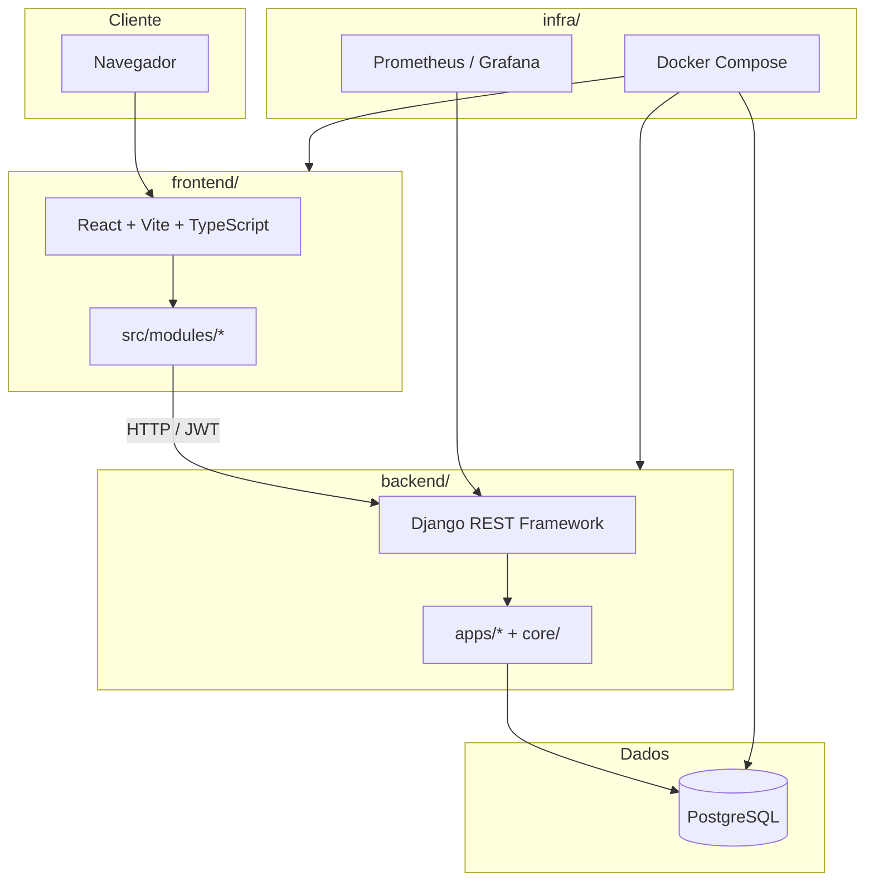
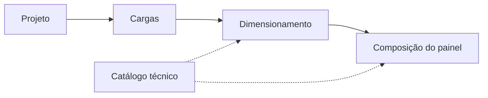
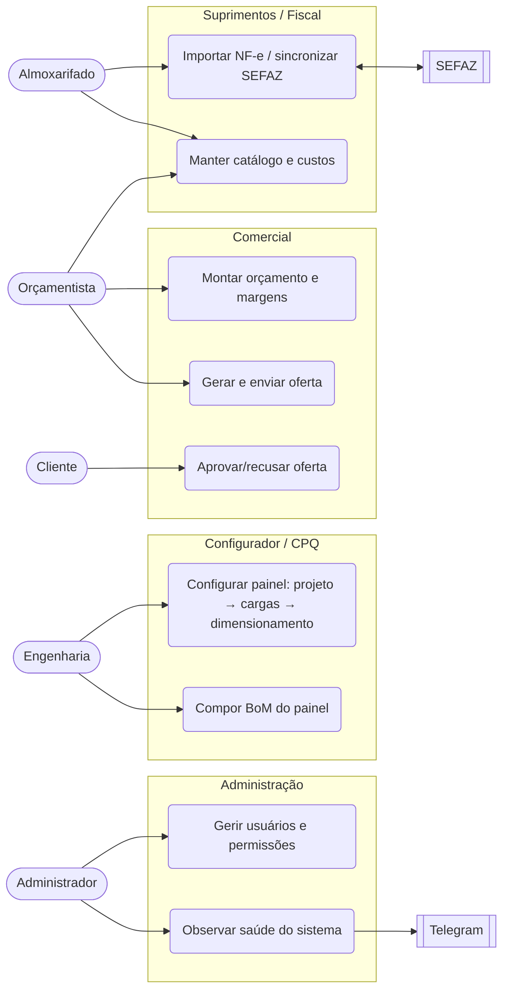
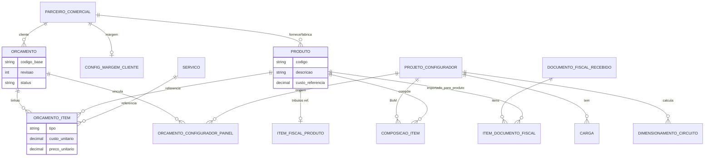

# Arquitetura

Visão de alto nível do monorepo **Configurador de Painéis Elétricos**.

> **Mapa de pastas e APIs:** [estrutura-codigo.md](estrutura-codigo.md). **Status dos módulos:** [modulos-erp.md](modulos-erp.md).

> **Portfólio ([RFC](../rfc.pdf)):** MVP = **CPQ** (catálogo + wizard + regras + BoM) em `configurador_paineis` e `catalogo`. O ERP no diagrama é evolução do monorepo, fora do § 2.7 do RFC. Ver [escopo-portfolio.md](escopo-portfolio.md).

O repositório evolui como ERP modular; o núcleo do portfólio é engenharia de painéis (projetos → cargas → dimensionamento → composição).

## Diagrama

## Estrutura de pastas

| Pasta | Função |
|-------|--------|
| `backend/` | API Django, regras de negócio, migrações, testes pytest |
| `backend/apps/` | Módulos de domínio (`catalogo`, `configurador_paineis`, `tarefas`, …) |
| `backend/core/` | Utilitários compartilhados (cálculos, permissões, modelos base) |
| `backend/config/` | Settings, URLs, registro de módulos ERP (`erp_registry.py`) |
| `frontend/` | SPA React; módulos espelham domínios em `src/modules/` |
| `infra/docker/` | Compose de dev, produção e monitoramento |
| `infra/monitoring/` | Prometheus, Grafana, regras de alerta |
| `docs/` | Documentação do projeto |
| `scripts/` | Utilitários de CI e manutenção |

## Fluxo principal do configurador

1. **Projeto** — identificação, cliente, recursos e contexto do painel.
2. **Cargas** — motores, resistências, alimentação geral e demais circuitos.
3. **Dimensionamento** — cálculos normativos, escolha de proteções e condutores.
4. **Composição** — lista técnica de materiais (sugestões automáticas e inclusão manual).

O **catálogo** alimenta seleção de componentes e dados fiscais/técnicos.

## Casos de uso (atores × funcionalidades)

Visão de alto nível dos principais atores e do que cada um faz no sistema. `SEFAZ` e
`Telegram` são sistemas externos; `Cliente` interage apenas pela oferta pública.

## Modelo de dados (núcleo)

Recorte das entidades centrais do portfólio (catálogo + CPQ + comercial + fiscal). Não é o
esquema completo do banco — apps de apoio (auth, tarefas, documentos, notificações, etc.) ficam
de fora. Fonte da verdade: os `models.py` de cada app.

> **Composição do preço da oferta:** `preco_unitario = custo_referencia × (1 + margem do cliente) × (1 + IPI)`.
> Ver [Catálogo › Custo de referência](../modulos/catalogo.md#custo-de-referência-e-composição-do-preço).

## API e metadados de módulos

- Rotas REST sob prefixos por app (ex.: configurador, catálogo, tarefas).
- Metadados descritivos dos módulos do roadmap: `backend/config/erp_registry.py`.
- Endpoint de meta por módulo: `GET .../erp/modules/<slug>/meta/` (consumido pelo frontend).

## Autenticação

- JWT (login/refresh) via DRF.
- Frontend: `src/modules/auth/` — contexto, guards de rota e permissões.

## Observabilidade

- `django-prometheus` no backend.
- Stack opcional: `infra/docker/docker-compose.monitoring.yml` (ver [monitoramento](../infra/monitoramento.md)).

## Próximos passos na documentação

- Detalhar contratos de API por módulo (OpenAPI ou tabelas de endpoints).
- Diagrama de deploy em produção (`docker-compose.prod.yml`).
- Expandir o modelo de dados para apps de apoio (tarefas, documentos, notificações, RH).
