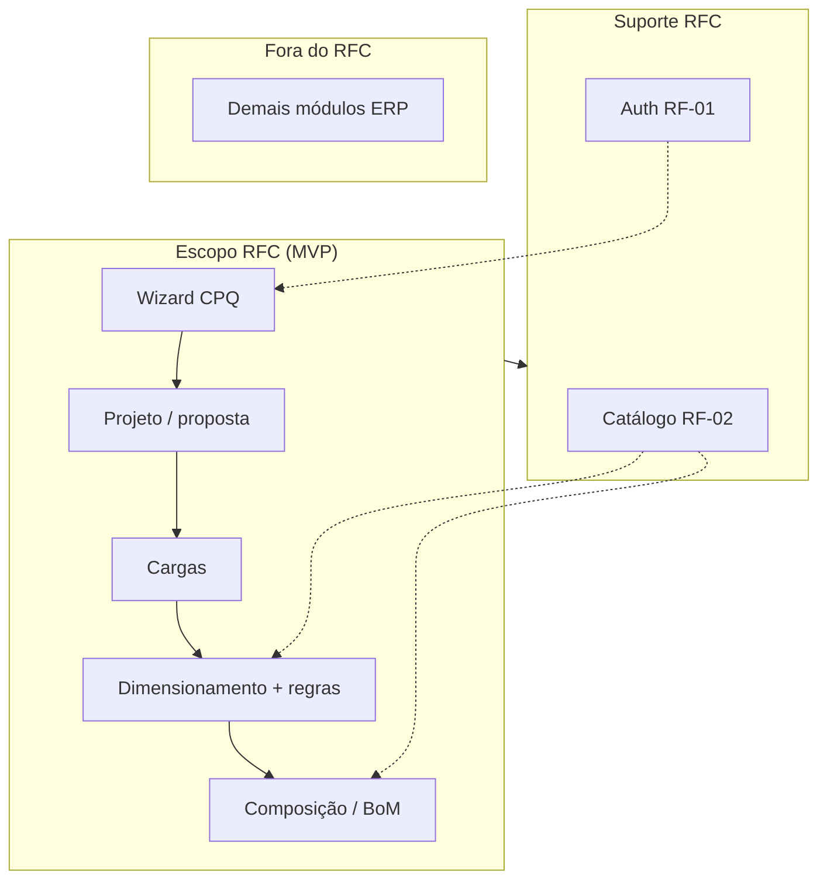

# Escopo do portfólio (disciplina)

> **Leitura obrigatória.** Este repositório contém código além do que a disciplina de portfólio exige. O compromisso formal está no **[RFC (PDF)](../rfc.pdf)** e no [resumo do RFC](../portfolio/rfc.md).

## Compromisso (RFC)

**Título oficial (RFC):** *Módulo de Auxílio à Escolha de Materiais para Orçamentos de Painéis Elétricos*.

**Produto:** aplicação web **CPQ/PCS** que guia o orçamentista, **valida regras técnico-normativas** e gera **BoM (lista de materiais)** com **estimativa de custos**, para painéis elétricos de baixa tensão (caso ZFW Engenharia).

**MVP comprometido** (RFC):

- Catálogo com atributos técnicos/comerciais  
- **Assistente passo a passo (wizard)**  
- Regras essenciais de compatibilidade (+ sugestões)  
- BoM e custos; exportação PDF/CSV (metas do documento)  
- Autenticação, propostas e auditoria (escopo mínimo do RFC)

No código, o núcleo está em **`configurador_paineis`** + suporte de **`catalogo`** e **`accounts`**:

| Entregável RFC | Onde está no código |
|----------------|---------------------|
| Wizard (RF-04) | `ProjetoWizardPage`, rotas `/projetos/.../fluxo/:etapa` |
| Validações (RF-05) | `dimensionamento/services/` |
| Sugestões (RF-06) | `composicao_painel/services/sugestoes/` |
| BoM (RF-07) | Composição + evolução em `orcamentos` |
| Projetos / propostas (RF-09) | `projetos/`, `orcamentos/` |
| Catálogo (RF-02, RF-10) | `apps.catalogo` |

**Fluxo conceitual no RFC (RF-04):** alimentação → proteção → comandos → invólucro → acessórios.  

**Fluxo implementado no wizard:** projeto → cargas → dimensionamento → composição. Ver [configurador-paineis/README.md](../modulos/configurador-paineis/README.md).

Documentos de apoio:

- [Rastreabilidade RF/RNF](../portfolio/rastreabilidade-requisitos.md)  
- [Mapa de API](../portfolio/mapa-api-wizard.md)  
- [Relatório de conformidade](../portfolio/relatorio-conformidade.md)  
- [Checklist de testes](../checklist-testes.md)

## O que NÃO é entregável do portfólio

O RFC limita explicitamente (**§ 2.7**): **sem integração direta com ERP/CRM** — apenas exportação por arquivo ou API simples.

Os apps `tarefas`, `crm`, `estoque`, `compras`, etc. no monorepo são **evolução de produto / roadmap**, não escopo adicional do RFC. Não devem ser apresentados como parte do MVP acadêmico.

## Diagrama de escopo

## Métricas de sucesso (RFC § 2.9)

Referência para avaliação — metas do documento, não garantias automáticas do repo:

- Redução ≥ **30%** do tempo médio de elaboração vs. baseline  
- Redução ≥ **50%** de erros de composição vs. baseline  
- p95 ≤ **500 ms** em busca/validação do wizard  
- Cobertura de testes ≥ **20%** no MVP  
- ≥ **80%** das regras essenciais do catálogo inicial cobertas pelo motor de regras  

## Como ler a documentação

| Documento | Foco |
|-----------|------|
| [portfolio/rfc.md](../portfolio/rfc.md) | Resumo fiel ao PDF |
| [configurador-paineis](../modulos/configurador-paineis/README.md) | **Entregável principal** |
| [modulos-erp.md](modulos-erp.md) | Monorepo completo; coluna **Portfólio** |
| Demais `docs/modulos/*.md` | Referência ou stubs ERP |

## Critérios de “pronto” para o portfólio

Alinhado ao RFC e à [rastreabilidade](../portfolio/rastreabilidade-requisitos.md):

- [ ] Wizard percorrível de ponta a ponta (projeto → composição/BoM)
- [ ] Catálogo utilizável com busca mínima (RF-10)
- [ ] Validações e sugestões no caminho crítico (RF-05, RF-06)
- [ ] BoM coerente com composição (RF-07); export CSV/PDF conforme marco (RF-08)
- [ ] Auth e perfis básicos (RF-01)
- [ ] Checklist de testes preenchido ([checklist-testes.md](../checklist-testes.md))
- [ ] README e docs deixam claro: **produto acadêmico = módulo CPQ/wizard**, não ERP completo

## Evolução do repositório

O monorepo pode crescer (ERP, monitoramento, fiscal). Isso **não altera** o escopo do RFC: na documentação e na demo do portfólio, priorize o **wizard de configuração de painéis** e o catálogo que o sustenta.
