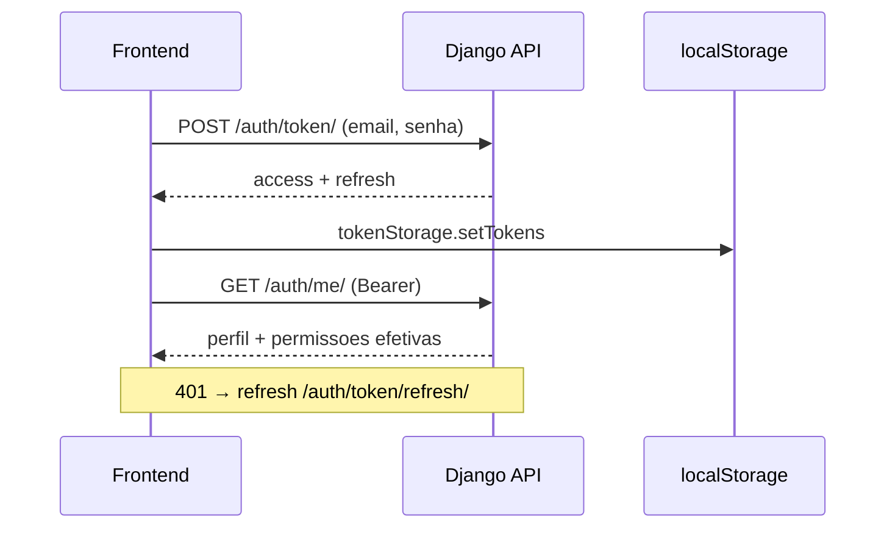

# Estrutura do código

Mapa de navegação do monorepo: onde ficam backend, frontend, APIs e como os módulos se correspondem.

> **Portfólio:** o caminho crítico é **configurador de painéis** + **catálogo** + **auth**. Demais apps são evolução ERP. Ver [escopo-portfolio.md](escopo-portfolio.md) e [modulos-erp.md](modulos-erp.md).

## Monorepo

```
Configurador_Paineis_Eletricos/
├── backend/          # Django + DRF + PostgreSQL
├── frontend/         # React + TypeScript + Vite
├── docs/             # Documentação funcional e técnica
├── infra/docker/     # Compose (dev, prod, monitoramento)
└── scripts/          # Automação e validação
```

| Camada | Stack principal | Testes |
|--------|-----------------|--------|
| Backend | Django 5, DRF, SimpleJWT, pytest | `pytest backend -q` |
| Frontend | React 19, React Router, TanStack Query, Vitest | `cd frontend && npm test` |
| API | Prefixo `api/v1/` | Testes por app em `backend/apps/*/tests/` |

## Backend

### Layout

```
backend/
├── config/                 # settings, urls, JWT, erp_registry, health
├── core/                   # choices, cálculos, permissões, BaseModel
└── apps/
    ├── accounts/           # CustomUser, permissões efetivas
    ├── catalogo/
    ├── configurador_paineis/
    │   ├── projetos/
    │   ├── cargas/
    │   ├── dimensionamento/
    │   ├── composicao_painel/
    │   ├── selecao_componentes/   # (serviços internos)
    │   └── wizard/                  # (estrutura evolutiva)
    ├── cadastros/
    ├── rh/
    ├── tarefas/
    ├── fiscal/
    ├── orcamentos/
    ├── configuracoes_erp/
    └── …                         # stubs de roadmap (crm, estoque, …)
```

### Apps com API exposta (`config/urls.py`)

Todas as rotas abaixo usam o prefixo **`/api/v1/`**.

| Prefixo / rota | App Django | Responsabilidade |
|----------------|------------|------------------|
| `auth/token/`, `auth/me/` | `config` + `accounts` | JWT e perfil do utilizador |
| `auth/users/`, `auth/user-*` | `accounts` | Administração de utilizadores |
| `projetos/`, `dashboard/resumo/` | `configurador_paineis.projetos` | Projetos e dashboard |
| `cargas/` | `configurador_paineis.cargas` | Circuitos e cargas do painel |
| `dimensionamento/` | `configurador_paineis.dimensionamento` | Cálculos normativos |
| `composicao/` | `configurador_paineis.composicao_painel` | BoM / composição |
| `catalogo/` | `catalogo` | Produtos, categorias, importação NF-e |
| `fiscal/itens-fiscais/` | `fiscal` | Itens fiscais por produto (leitura) |
| `cadastros/` | `cadastros` | Parceiros, contatos, endereços |
| `rh/` | `rh` | Colaboradores, jornadas, equipes |
| `tarefas/` | `tarefas` | Kanban, apontamentos, relatórios |
| `erp/orcamentos/` | `orcamentos` | Propostas comerciais |
| `erp/configuracoes/` | `configuracoes_erp` | Parâmetros globais |
| `erp/modules/<slug>/meta/` | `config.erp_registry` | Metadados do roadmap (sem DB) |

Apps registrados em `INSTALLED_APPS` sem URL própria (stubs ou uso interno): `crm`, `compras`, `estoque`, `producao`, `financeiro`, `qualidade`, `conformidade`, `expedicao`, `pos_venda`, `documentos`, `notificacoes`, `auditoria`, `integracoes`, `relatorios`, `pedidos_venda`.

### Padrão interno de um app Django

```
apps/<dominio>/
├── models.py | models/
├── api/
│   ├── views.py
│   ├── serializers.py
│   └── urls.py
├── services.py | services/     # regras de negócio (quando aplicável)
├── selectors.py | selectors/   # consultas reutilizáveis (quando aplicável)
├── admin.py
├── apps.py
├── migrations/
└── tests/
```

**Permissões:** views DRF usam `HasEffectivePermission` (`accounts`) com `required_permission` ou `PermissionKeys` em `core/permissions.py`. Administradores (`tipo_usuario` ADMIN ou superuser) têm acesso total.

**Shared core:** `core/choices/` (enums), `core/calculos/` (eletrica, condutores), `core/models/` (`BaseModel`, mixins).

## Frontend

### Layout

```
frontend/src/
├── app/
│   ├── router/AppRouter.tsx       # /login + rotas autenticadas
│   └── navigation/
│       └── collectNavigation.ts   # agrega *.registry de cada módulo
├── components/                    # layout, feedback, UI compartilhada
├── services/
│   ├── apiClient.ts               # Axios + JWT + refresh
│   └── http/
└── modules/
    ├── auth/                      # sessão, guards, login
    ├── modulos/                   # launcher `/` (moduleCatalog)
    ├── configurador_paineis/      # dashboard, projetos, cargas, …
    ├── catalogo/
    ├── fiscal/
    ├── tarefas/
    ├── erp/                       # shell ERP (orçamentos, config, cadastros/RH via reuse)
    ├── cadastros/                 # telas usadas também em /erp/cadastros
    ├── rh/
    ├── usuarios/                  # admin de contas
    └── placeholders/              # rotas reservadas do roadmap
```

### Registo de rotas e menu

Cada módulo exporta um **`* .registry.ts(x)`** com:

- `*Routes` — entradas `{ path, element }` para o React Router
- `*MenuItems` — links do menu lateral (com `requiresPermission` quando necessário)

`collectNavigation.ts` concatena todos os registries e ordena o menu por `order`.

Guards comuns:

| Componente | Uso |
|------------|-----|
| `RequireAuth` | Sessão JWT válida |
| `RequirePermission` | Permissão efetiva (`permissionKeys.ts`) |
| `RequireAppAdmin` | Admin da aplicação |

### Módulos frontend ↔ backend

| Frontend (`src/modules/`) | Backend | Rotas UI principais | API principal |
|---------------------------|---------|----------------------|---------------|
| `auth` | `accounts` + `config` (JWT) | `/login` | `/auth/token/`, `/auth/me/` |
| `modulos` | `config.erp_registry` | `/` | `/erp/modules/:slug/meta/` |
| `configurador_paineis` | `configurador_paineis.*` | `/dashboard`, `/projetos`, `/cargas`, … | `/projetos/`, `/cargas/`, … |
| `catalogo` | `catalogo` | `/catalogo`, import NF-e | `/catalogo/produtos/`, … |
| `fiscal` | `fiscal` + catálogo | `/fiscal`, `/fiscal/itens-fiscais` | `/fiscal/itens-fiscais/` |
| `tarefas` | `tarefas` | `/tarefas` | `/tarefas/` |
| `erp` | `orcamentos`, `configuracoes_erp`, cadastros, rh | `/erp/orcamentos`, `/erp/configuracoes`, … | `/erp/orcamentos/`, … |
| `cadastros` | `cadastros` | `/erp/cadastros` (via erp.registry) | `/cadastros/` |
| `rh` | `rh` | `/erp/rh` | `/rh/` |
| `usuarios` | `accounts` | `/administracao/utilizadores` | `/auth/users/` |

O **catálogo de módulos** no launcher (`modulos/moduleCatalog.ts`) espelha `backend/config/erp_registry.py` (status `available` vs `planned`).

### Configurador de painéis (submódulos)

Fluxo técnico do wizard:

```
projetos → cargas → dimensionamento → composicao
```

| Subpasta frontend | App backend | Registry |
|-------------------|-------------|----------|
| `dashboard/` | `projetos` (resumo) | `dashboard.registry` |
| `projetos/` | `projetos` | `projetos.registry` |
| `cargas/` | `cargas` | `cargas.registry` |
| `dimensionamento/` | `dimensionamento` | `dimensionamento.registry` |
| `composicao/` | `composicao_painel` | `composicao.registry` |

Agregador: `configurador_paineis.registry.ts`.

Convenção por submódulo: `types/`, `services/`, `hooks/`, `pages/`, `components/`.

## Autenticação (fluxo resumido)



- Backend: `CustomUser` (`accounts`), JWT SimpleJWT, permissões por tipo + extras − negadas.
- Frontend: `AuthProvider`, `apiClient` com interceptor de refresh.

## Integrações entre domínios

| Origem | Destino | Exemplo |
|--------|---------|---------|
| Catálogo | Fiscal | Importação NF-e cria `ItemFiscalProduto` |
| Fiscal | Orçamentos | `p_ipi_referencia_produto` na linha da proposta |
| Cadastros | Orçamentos | Cliente, contato, margens por parceiro |
| RH | Tarefas | Jornada valida apontamento de horas |
| Cadastros | Catálogo | Fabricante / parceiro comercial |
| Configurador | Catálogo | Seleção de materiais na composição |

## Onde procurar

| Objetivo | Caminho |
|----------|---------|
| Adicionar rota/menu frontend | `modules/<modulo>/*.registry.tsx` + `collectNavigation.ts` |
| Expor nova API | `apps/<app>/api/` + include em `config/urls.py` ou `erp_api_urls.py` |
| Permissão nova | `core/choices/usuarios.py` + `frontend/.../permissionKeys.ts` |
| Metadados roadmap ERP | `config/erp_registry.py` + `modulos/moduleCatalog.ts` |
| Documentação de módulo | `docs/modulos/` |
| RFC / portfólio | `docs/rfc.pdf`, `docs/portfolio/` |

## Documentação relacionada

- [Arquitetura](arquitetura.md) — diagramas e camadas
- [Módulos do ERP](modulos-erp.md) — status implementado vs stub
- [Backend](../desenvolvimento/backend.md) — setup e comandos
- [Frontend](../desenvolvimento/frontend.md) — variáveis de ambiente e build
- [Índice geral](../README.md)
